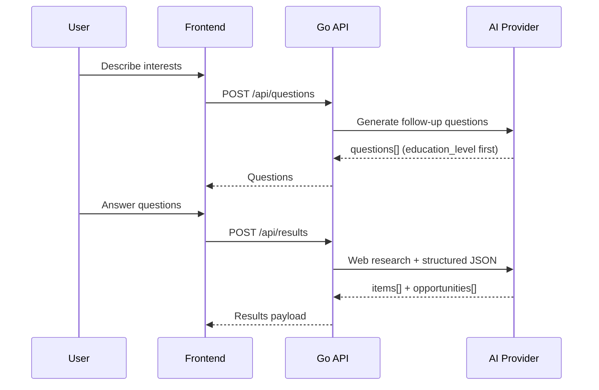

<div align="center">
<h1>Via</h1>

A Bulgarian education guidance app that helps students and parents find real school
and university paths. Users describe their interests; the app asks clarifying
questions (starting with age/class), then returns grounded recommendations backed
by web search and live data.

[](https://goreportcard.com/report/github.com/so1icitx/Via)
[](https://github.com/so1icitx/Via/blob/main/backend/go.mod)
[](#testing)
[](#testing)

</div>

## What it does

**Via** turns a free-text question like *"искам киберсигурност в Пловдив"* into a structured guidance session:

1. **Questions** — the AI asks 3–5 follow-ups. The first is always `education_level` (age/class), so the app routes correctly between gymnasium and university paths.
2. **Research** — the backend searches the web for real institutions, admission dates, fees, and programs.
3. **Results** — a JSON payload with detailed `items` (schools/universities) and separate `opportunities` (events, courses, hackathons).

The UI is in Bulgarian by default; the API supports `lang: "bg"` or `"en"`.

## Architecture

```
Browser (Next.js)  →  Go API (Gin)  →  AI provider (Groq / Gemini / OpenAI)
                              ↓
                         PostgreSQL
```

| Layer | Stack |
|-------|-------|
| Frontend | Next.js 16, React 19, Tailwind |
| Backend | Go 1.25, Gin, pgx |
| AI | Pluggable: Groq (default), Gemini, OpenAI — all with web search for results |
| Auth | Email/password + Google OAuth, HTTP-only session cookies |
| Data | PostgreSQL 16 (users, sessions, saved results) |

### Guidance flow



## Quick start

### Prerequisites

- Go 1.25+
- Node.js 20+
- Docker (for PostgreSQL)

### 1. Database

```bash
docker compose up -d
```

### 2. Backend

```bash
cp .env.example backend/.env
# Edit backend/.env — at minimum set GROQ_API_KEY (or another AI provider key)

cd backend
go run ./cmd/api
```

API listens on `http://127.0.0.1:8080`. Health check: `GET /health`.

### 3. Frontend

```bash
cd frontend
npm install
npm run dev
```

App runs at `http://localhost:3000` and proxies API calls to the backend.

## Configuration

Copy [`.env.example`](.env.example) to `backend/.env`. Key variables:

| Variable | Purpose |
|----------|---------|
| `AI_PROVIDER` | `groq` (recommended), `gemini`, or `openai` |
| `GROQ_API_KEY` | Free-tier Groq key with web search |
| `GEMINI_API_KEY` | Google AI Studio key |
| `OPENAI_API_KEY` | OpenAI fallback |
| `DATABASE_URL` | PostgreSQL connection string |
| `GOOGLE_CLIENT_ID` / `GOOGLE_CLIENT_SECRET` | Google OAuth (optional for email-only use) |

If `AI_PROVIDER` is unset, the backend auto-detects from whichever API key is present (Groq → Gemini → OpenAI).

## API overview

| Method | Path | Auth | Description |
|--------|------|------|-------------|
| `GET` | `/health` | — | Liveness check |
| `POST` | `/api/questions` | — | Generate follow-up questions |
| `POST` | `/api/results` | — | Generate guidance results |
| `POST` | `/api/auth/sign-up/email` | — | Create account |
| `POST` | `/api/auth/sign-in/email` | — | Sign in |
| `GET` | `/api/auth/get-session` | cookie | Current session |
| `GET` | `/api/saved-results` | cookie | List saved results |
| `POST` | `/api/saved-results` | cookie | Save a result |

## Testing

The Go backend has **168 unit and integration tests** across handlers, auth, AI clients, prompts, repository, and middleware.

```bash
cd backend
make test-cover
```

Current coverage on `internal/*` packages: **80.4%** (excluding `testutil` helpers).

| Package | Coverage |
|---------|----------|
| `internal/ai` | 95.8% |
| `internal/config` | 85.2% |
| `internal/guidanceai` | 85.1% |
| `internal/service/auth` | 83.2% |
| `internal/middleware` | 89.7% |
| `internal/handler` | 79.9% |

Integration tests use a real PostgreSQL instance (`docker compose up -d`). If Postgres is unavailable, DB-dependent tests are skipped.

```bash
# HTML coverage report
make test-cover-html
open coverage.html
```

## Project layout

```
via/
├── backend/          Go API, migrations, tests
├── frontend/         Next.js app
├── docker-compose.yml
└── .env.example
```
